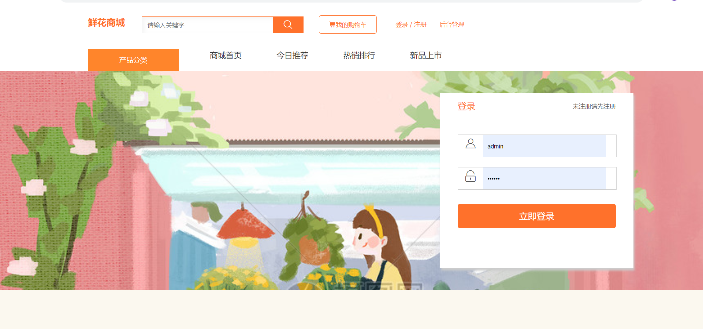
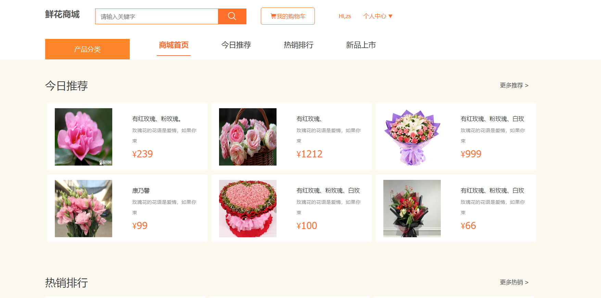
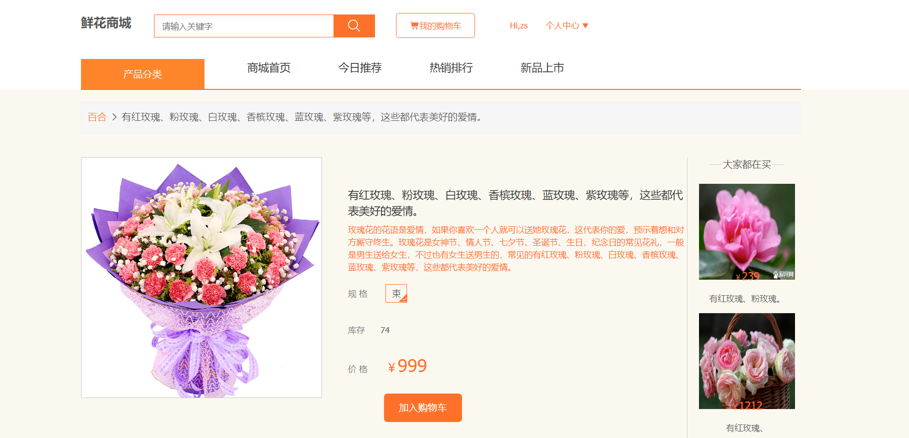
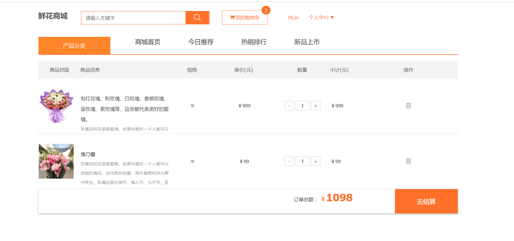
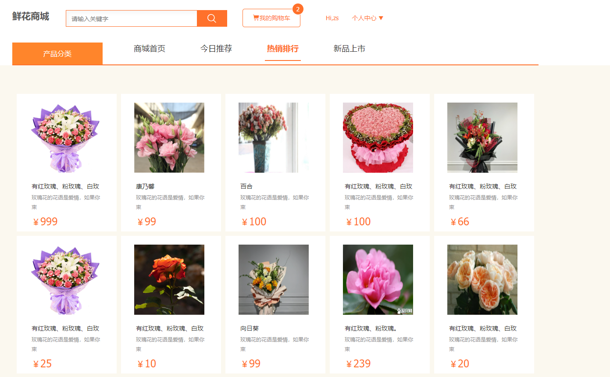
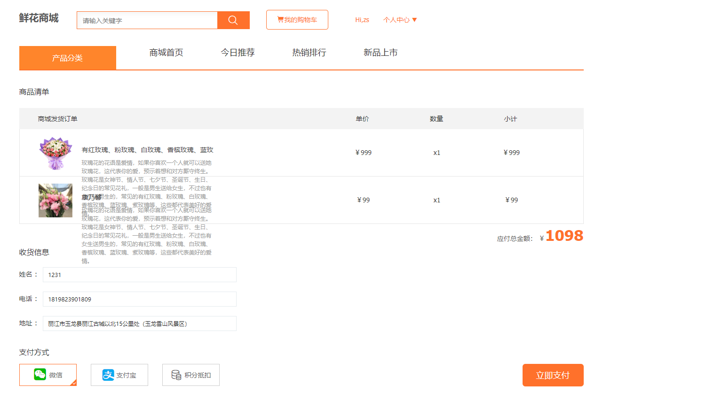
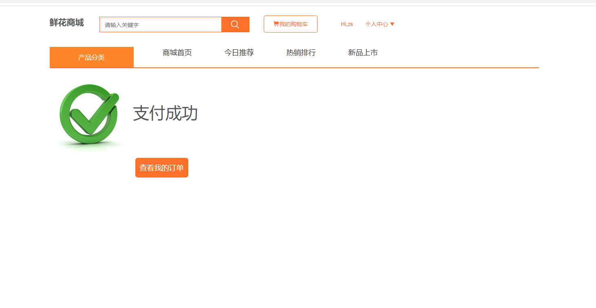
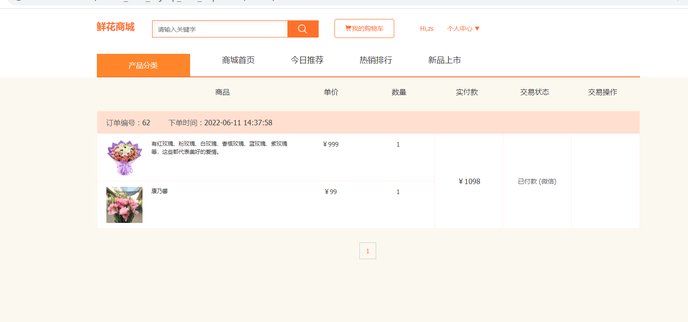
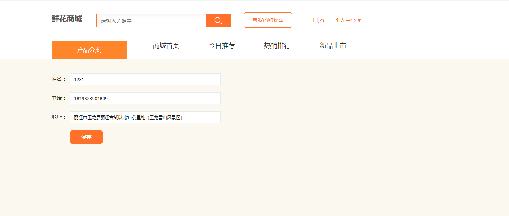
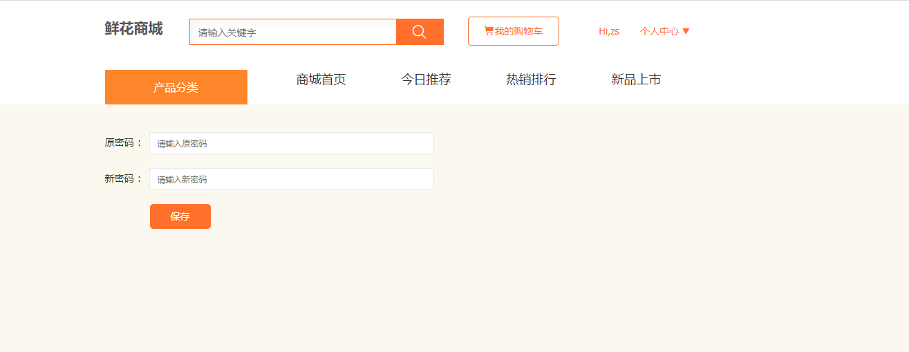

# 鲜花销售网站管理信息系统
基于ssm框架实现的java鲜花销售网站jsp项目，可二次修改为图书商城、服装商城、宠物商城、动漫商城、零食商城、鲜花商城等多种电商主题商城管理系统。用户功能：登录注册、个人中心编辑、商品评价、搜索功能、收藏功能、加入购物车、下单功能等；管理员功能：商品管理、订单管理、用户管理、轮播图管理、评论管理、账户管理。运行环境：eclipse、jdk1.8、tomcat7.0、mysql。系统页面设计良好、内容丰富、功能齐全，适合用做课设和毕设等学习。如需源码及数据库文件，请联系Q
## 项目简介：

##联系方式：23332535743@qq.com
## 采用技术 ： 
- 前端：HTML + CSS + JavaScript + Bootstrap + Jquery + Ajax
- 后端：servlet +Jps + ssm框架+ Java

## 开发环境 ：
- 工具：IDEA、Navicat、Git
- 环境：JDK 1.8、Tomcat 7.0、Mysql 8.0
- 项目管理：Maven
- 代码托管平台：GitHub
.2 功能需求
消费者作为用户可以通过该系统可进行如下操作：

(1) 用户注册：消费者可以填写资料信息注册，进行用户注册。
(2) 查看商店产品：消费者可以查看产品信息并查看产品详细信息。
(3) 在线订购：客户可以根据需要将相应的商品添加到购物车中进行订购。
(4) 查看订单信息：客户订购后，将记录页面上可操作自己的特定订单信息。
(5)确认收货：客户收到鲜花产品后，客户可以确认收到订单。

管理员通过该系统可进行如下活动：
（1）登录：管理员可以进行后台登录。
（2）用户管理：管理员可以对用户的账号以及个人信息的进行修改，删除查看等等操作。
（3）商品管理：管理员可以管理、修改和删除有关产品的特定信息。
（4）类目管理：管理员可以对商品的类目信息进行管理，并对其修改及删除。
（5）订单管理：管理员可以对订单情况进行查看，并对其修改及删除。
（6）修改密码：管理员可以管理员的账号信息以及密码的进行修改。

## 功能模块 :  

**前台部分，主要分为以下几个模块：**
本网站的功能主要分为前台管理和后台管理两部分。前台管理主要为用户提供便捷的购物体验，包括用户的注册、用户的登录、商品的信息浏览、添加购物车、提交订单、付款等功能。用户可以通过首页浏览商品信息，选择心仪的商品加入购物车，提交订单并完成付款，同时也可以查询自己的订单状态。后台管理则为管理员提供了一系列的管理工具，包括管理员登录、用户信息管理、商品管理、订单管理等功能。系统网站的功能结构图如图4.1所示。

## 项目访问 :  
浏览器访问路径：http://localhost:8080/lsepidemicsituationsystem_war_exploded/FrontWebServlet
